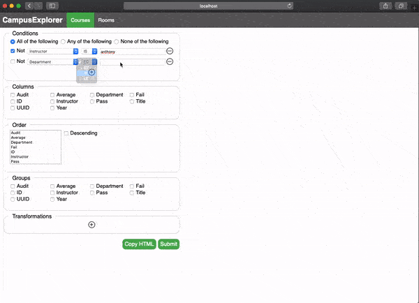
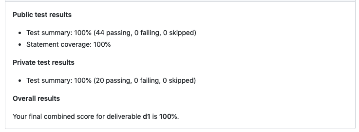
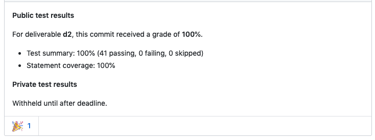
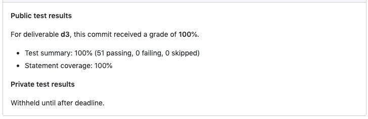

## Stack
* Backend: TypeScript, Node
* Frontend: JavaScript
* Testing: Mocha/Chai (backend), Karma (frontend)
* Git/ Github, full stack web development
* Test Driven Development

# CPSC 310 Project Campus Explorer Introduction
A full stack web development project split into four sprints, done as part of UBC Course CPSC310 software engineering. The first three sprints are server-side development using Node. The fourth sprint is client-side development.

## Development

```
$ git clone https://github.com/fisharwoman/UBCCampusExplorer.git
$ cd UBCCampusExplorer
$ npm install
$ npm start
```

## Visuals


## Topics covered in the course project

* Software specifications
* Agile development
* High and low-level design (this is the primary course focus)
* Refactoring
* REST
* Async development

## Disclaimer

Due to the collaboration policy and reusability of the project, not all the written codes will be shared to benefit the future cohorts. This is to only showcase the final product of our work, and showcase some common codes that will not affect the policy. Only classes with codes written by myself have been retained.

## Grading

The project grade for this course was:

| Project Sprint				| Grade |
| :--			 			    | :-- 	|
| Project Sprint 1 (d1)			| 100 %	|
| Project Sprint 2 (d2)			| 100 %	|
| Project Sprint 3 (d3)			| 100 %	|
| Project Quality Check	 (d4)	|  %	|





